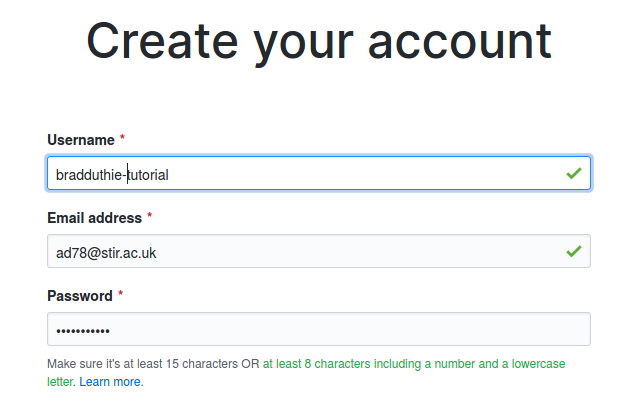
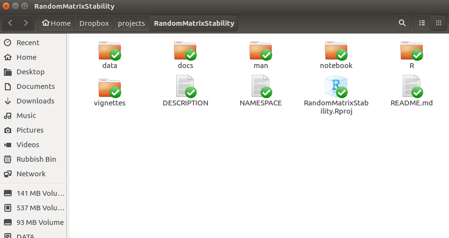
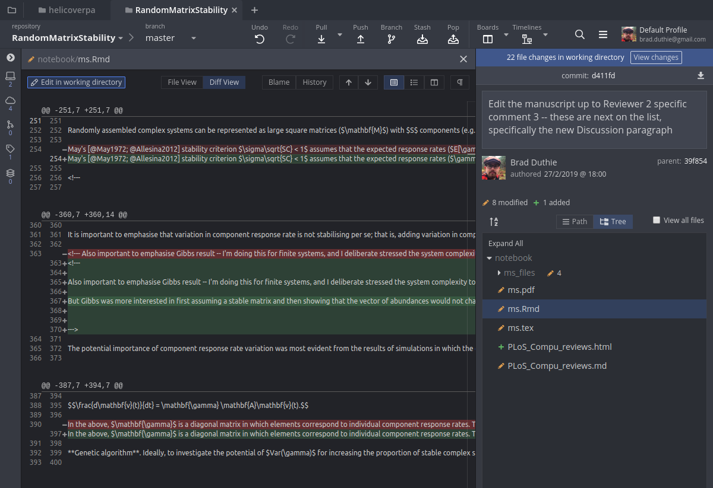
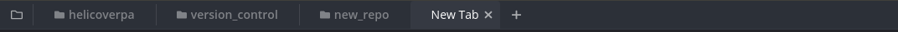
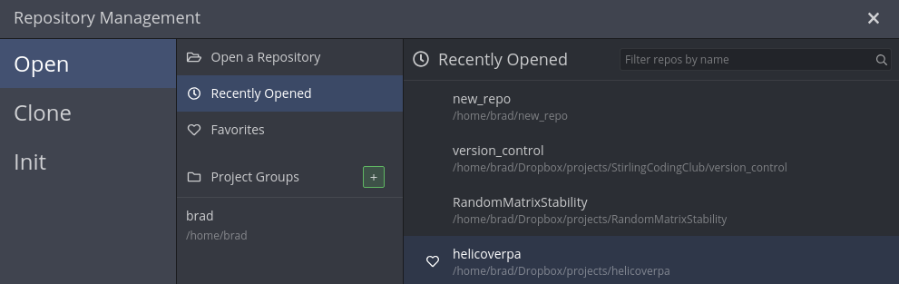
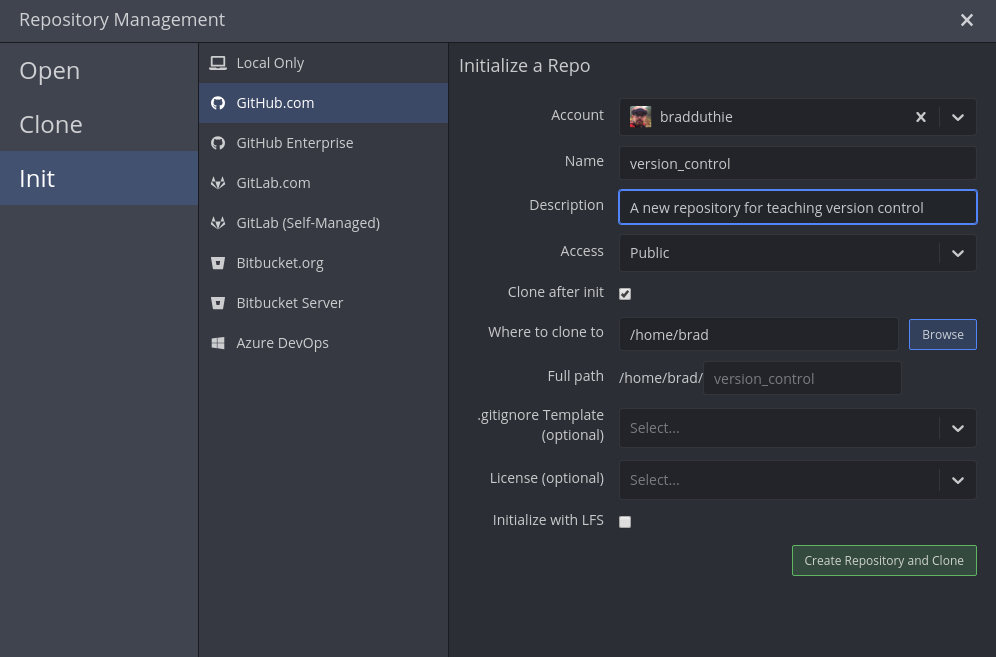

Contents
================================================================================

********************************************************************************

**These notes are provided as a guided tutorial to accompany a workshop focused on the use of version control to improve workflow in scientific research, but they can also be used as a standalone introduction to the subject. These notes will help the reader begin using git version control software and the [GitHub](http://github.com) hosting service. An introduction to git is provided using the commandline interface and [GitKraken](http://gitkraken.com) software, but it is only necessary to learn one to be able to use git effectively. After finishing this tutorial, the reader should be able to use version control in their own scientific workflow.**

********************************************************************************

- [Introduction: What is version control?](#what_is_vc)
- [Things to do before getting started](#todo)

    1. [Signing up with a GitHub account](#sign_up_GitHub)
    2. [Downloading GitKraken software](#Download_GitKraken)
    3. [Putting project files in a common folder](#place_files)
    4. [Understanding folder structure](#folder_structure)
    5. [Understanding text versus binary files](#text_binary)

- [Using GitKraken & Command Line Interface (CLI)](#GK_CLI)

    1. [Initialising a git repository](#step1)
    2. [Linking your repository with GitHub](#ghlink)
    3. [Add and commit files](#step3)
    4. [Pushing and pulling with GitHub](#step4)
    5. [Branches in git](#branches)
    6. [Dealing with merge conflicts](#step6)

- [How to use git in GitHub](#how_use_gh)
- [Additional resources](#whatelse)

********************************************************************************

<a name="what_is_vc">Introduction: What is version control?</a>
================================================================================

[Version control](https://en.wikipedia.org/wiki/Version_control) is any system that records changes made within a set of files over time so that different versions of files can be managed and, if necessary, recovered. **Put more intuitively**, version control is a way of taking a snapshot in time (called a 'commit') of all the files in one of your folders (called 'repositories'); as you make changes to the files within your folder, you can always come back to previous snapshots that you've taken (if, e.g., you make a change that you regret, or need information from a previous point in time). You can even have multiple different versions of the same folder existing in parallel (called branches). You can think of it as an extra step on top of 'saving' a file -- a step that solidifies a key point in time for your work, records how it changed from previous and subsequent points in time, and records who made the change, when, and why.

Version control is indispensable for large coding projects with multiple developers collaborating on the same code, but it's also a very useful tool for the workflow of scientific research. Using version control can allow you to better manage data files, analysis files (e.g., R code), manuscript files, and more in a way that keep things clean and removes the anxiety of losing track of which file is the 'right' one. 

Version control is also an excellent tool for doing open science. By keeping a record of how your data, analysis, and manuscripts change over time, the process of doing science becomes more transparent. By uploading your progress to [GitHub](http://github.com), you can make the whole process of doing science accessible to others, and have evidence of priority and accuracy in your conclusions (you can also keep repositories private, though this [costs a small amount](https://github.com/pricing) unless [you are a student](https://help.github.com/articles/applying-for-a-student-developer-pack/)). 

<br>

![*An example of the timeline of commits for a recent project. Bold titles on top show more recent changes committed to the repository; the bold messages are written at the time of committing, and make it easier to see important changes added over time. In GitHub, you can click on these bold titles to see what changes were made since the last commit; from here, you can also see the whole repository as it was during the time of commit (you can also do this by clickling on the `< >` buttons on the right).*](images/VC_intro.png)

<br> 

There are many different [types of version control](https://en.wikipedia.org/wiki/List_of_version_control_software) available. Here, I am going to focus only on [git](https://git-scm.com/) version control software, which has the advantage of being free, open source, available on all platforms (Linux, Mac, and Windows), and the most popular software among research scientists. The software was invented by [Linus Torvalds](https://en.wikipedia.org/wiki/Linus_Torvalds), the same developer who created the [Linux kernel](https://en.wikipedia.org/wiki/Linux_kernel).

In this introduction to using version control, I am going to focus heavily on using two software tools that work with [git](https://git-scm.com/), [GitHub](http://github.com) and [GitKraken](http://gitkraken.com). Like git, both [GitHub](http://github.com) and [GitKraken](http://gitkraken.com) are free for basic use, though more advanced options can come with a small cost. These two tools make using git much easier, especially if you don't like the idea of working within the command line. [GitHub](http://github.com) offers a massive online platform where you can store your git repositories, discover and download new repositories, and collaborate with other GitHub users (e.g., in organisations such as the [Stirling Coding Club](https://github.com/StirlingCodingClub)). [GitKraken](http://gitkraken.com) provides a nice graphical user interface for using git, visualising your repository, and linking to GitHub. As you become proficient with git, you might find yourself start thinking less in terms of individual files and file versions, and more in terms of commits and branches with inter-related files.

First, I am going to briefly talk about how to use git entirely *within* GitHub on your browser. This requires fewer steps than using GitKraken, but it can only get you so far because you cannot work with the changes that you make directly on GitHub. For example, if you edit an R file in GitHub, you would have no way to run the code without pulling the file from GitHub to your local repository.

********************************************************************************


<a name="todo">Things to do before getting started </a>
================================================================================

Although not strictly necessary, signing up with a GitHub account and downloading GitKraken will make it easier to start using git. Similarly, work flow with git will be much easier if you have everything associated with a particular project organised into a single folder on your computer (including data, analysis files, notes, manuscript drafts, etc.). Lastly, there are some key details about how files are stored and differentiated that are useful to know.

1. <a name="sign_up_GitHub">Signing up with a GitHub account</a>
--------------------------------------------------------------------------------

If you are just starting out with git, I recommend [signing up with a GitHub account](github.com/join). GitHub is a free site where you can host your own projects and collaborate with other researchers. It is mostly known as a host for code and software development, but any projects that are version controlled with git can also be hosted here. Chances are, if there is an R package that you reglularly use (e.g., [ggplot2](https://github.com/tidyverse/ggplot2), [vegan](https://github.com/vegandevs/vegan), [lme4](https://github.com/lme4/lme4)), then the code and entire development history will be publicly available, along with a [issues board](https://github.com/lme4/lme4/issues) containing known bugs, questions, and requests for new features.



Select a username and password to [sign up](github.com/join), then click on the button to select a plan. A free plan is likely to be sufficient for all of your needs, but if you are a student, then you can also [apply for a student developer pack](https://help.github.com/en/github/teaching-and-learning-with-github-education/applying-for-a-student-developer-pack). In either case, you will be able to create an unlimited number of public and private (i.e., only visible to you) repositories and upload them to GitHub.

2. <a name="Download_GitKraken">Download GitKraken software</a>
--------------------------------------------------------------------------------

I recommend [downloading GitKraken](https://www.gitkraken.com/download) for getting started with git. By downloading GitKraken, you will automatically also download git. GitKraken itself is a [Graphical User Interface (GUI)](https://en.wikipedia.org/wiki/Graphical_user_interface) to make git much easier to use; no command line is necessary, so all of your version control needs are taken care of in a graphically rich point and click interface. For those who prefer to use the command line interface, I have included instructions for how to do this below too. Learning to use git in the command line is probably useful if you already use the command line in your normal work flow (or if you are interested in doing so), but if it's not something that you work with already, learning it here is probably more trouble than it's worth.

GitKraken is also free, and it easily integrates with GitHub and your GitHub account. And if you are a student and apply for the [GitHub student developer pack](https://help.github.com/en/github/teaching-and-learning-with-github-education/applying-for-a-student-developer-pack) as suggested [above](#sign_up_GitHub), the pack will come with a free version of [GitKraken Pro](https://www.gitkraken.com/student-resources).

3. <a name="folder_structure">Understanding folder structure</a>
--------------------------------------------------------------------------------

It is important to know where your project folder and all relevant files are stored on your computer. This might sound obvious, but it is actually easy to lose track of this information with a lot of software. Some programs can make it easy to not pay attention to where something is being saved or opened from, e.g., by picking a reasonable default location to save or having a File pulldown menu that lists 'Recent files' to open. Nevertheless, version control aside, it is good practice to always know where files are located on your computer, and it is generally more efficient to keep all of the files within a particular project in the same folder.

The location of your files (i.e., the path to your directory) will look a bit different depending on whether you are using Linux, Mac, or Windows. For example, here is where the file that you are reading is stored on my computer (Linux).

```{r}
getwd(); # Returns the working directory
```

If you run Mac, a path to directory might look something like the below.

```
/Users/brad/Dropbox/teaching/workshops/version_control
```

If you run Windows, your path to directory might look something like this.

```
C:/Users/brad/Dropbox/teaching/workshops/version_control
```

Note that in all of these examples, the names between dashes represent nested folders that lead to a folder of interest (in this case, 'version_control'). Your path might look different from any of the above, but the idea is the same. The folder or 'repository' that I am working with is named 'version_control', which itself is within a folder called 'workshops', which is within a folder called 'teaching', etc. Knowing this path to your project folder will make it easier to work with git, and easier to keep your work flow more organised. Note that 'version_control' itself can have files and sub-folders within it.
g
```{r}
list.files(path = ".", include.dirs = TRUE); # shows files in the working dir
```

The above is a list of all of the files in the current working directory, so, e.g., the path to this file is as below.

```
/home/brad/Dropbox/teaching/workshops/version_control/vc_notes.pdf
```

Note that there is one subfolder (which has no extension such as .pdf or .Rmd) named 'images', which is where I have saved all of the images for these notes and [accompanying slides](https://bradduthie.github.io/version_control/vc_slides.pdf).

```{r}
list.files(path = "images", include.dirs = TRUE);
```

To better understand the notation and lists above, you can browse 'version_control' [on GitHub](https://github.com/bradduthie/version_control) to see the files and image folder.


4. <a name="place_files">Putting project files in a common folder</a>
--------------------------------------------------------------------------------

There are a lot of ways that you can organise your workflow, but I strongly recommend giving any unique project on which you are working its own folder. This could be a folder for each unique manuscript in preparation or dissertation chapter, for each module to which you participate in as a student or teaching role, or for each administrative task that you perform. This makes version control easier by allowing you to track the entire history of an individual project (comprised of multiple inter-related files within a folder). An example for a research project might look like the below.



Separate folders in this project include data, analysis code, a manuscript in preparation, and project notes. The entire history is tracked on git and [available on GitHub](https://github.com/bradduthie/RandomMatrixStability). 

**To get started, identify a location on your computer and create a new folder with a project name**. This will be the folder that you later initialise as a git repository. Do not put anything in this folder just yet.


5. <a name="text_binary">Understanding text versus binary files</a>
--------------------------------------------------------------------------------

When working with git, it is important to understand the difference between [text files](https://en.wikipedia.org/wiki/Text_file) and [binary files](https://en.wikipedia.org/wiki/Binary_file). These are two general categories of file types; both work with git, but you can do a bit with text files that you cannot do with binary files. For the purpose of working with git, all that is important to know is the following:

- Text files can be viewed as plain text in any sort of text editor (e.g., Notepad, TextEdit, gedit) or Integrated Development Environment (e.g., Rstudio, VIM, Emacs). They include files with extensions such as .txt, .R, .csv, .html, .md, .tex (among many others). If you are unsure if something is a text file, try opening it up in a plain text editor such as Notepad or TextEdit. If what you open is readable, then you have probably opened a text file. If what open looks incoherent, then you have probably opened a binary file.

- Binary files need to be opened with special software to be readable (e.g., MSWord, Adobe Acrobat, Photo Viewer). They include files with extensions such as .pdf, .docx, .xlsx, .pptx, .jpg, .gif (among many others). If you try to open any of the aforementioned file types in a text editor such as Notepad, you will see a mess of characters that is impossible to interpret.

This distinction matters because while both text and binary files can be used with git, the only way to see changes made to a binary file is to open up old and new versions of it and manually compare them side by side. In contrast, git can point out changes made to text files directly; below is an example showing the changes between different versions of a text file (ms.Rmd) in the GitKraken interface.



Gitkraken shows lines that have been deleted (red) and added (green) after a file has been updated. This might not be important for some files that you work with, but it's good to keep in mind when using version control. **In the next section, we will get started by making a git repository. You should now have a folder in a known location on your computer where you can get started.** I will provide instructions for both GitKraken and the command line interface (CLI), but it is only necessary to know one of these. If you are just getting started, I recommend ignoring the CLI parts and learning the key concepts with GitKraken.

********************************************************************************


<a name="GK_CLI">Using GitKraken & Command Line Interface (CLI)</a>
================================================================================

This set of instructions will get you started working with git and GitHub. Throughout this guide, I will explain how to use the basic functions of git and link git with GitHub using both the free software [GitKraken](http://gitkraken.com) and the command line interface. **You do not need to know both GitKraken and the command line to use git**. One method for using git is sufficient, and unless you are already familiar with the command line, or wish to make it a part of your work flow, then I recommend using GitKraken to start off with git (i.e., feel free to ignore all of the command line instructions that follow). Note that GitKraken can run alongside whatever text editor (e.g., Rstudio) you're using to actually edit your text files, but you don't typically make edits from within GitKraken itself -- GitKraken is more like a file manager in this way; you can keep it open to stage, commit, push, pull, etc., while working on files in your git repository.

1. <a name="step1">Initialising a git repository</a>
--------------------------------------------------------------------------------

When you open [GitKraken](http://gitkraken.com), you should see a toolbar at the top of the program that looks something like the below (ignore the specific names, 'helicoverpa', 'version_control', etc.).



Click on the folder outline icon on the very left. This should open the Repository Management window, which will look something like the below. 



To initialise a new repository, click on the option 'Init' on the left. This will open up a window that looks something like the below.



Notice that there are several options in the middle tab. You can initialise a git repository that is 'Local Only', which means that the history of the project will only be saved on your own computer, and not hosted online (at least not yet). Alternativley, you can choose from multiple online hosts where you will later 'push' your files. Since you should have already [signed up with a GitHub account](sign_up_GitHub), choose the tab 'GitHub.com' as selected above. You should see your account listed in the right tab; if it's not there, then you need to link GitKraken to your GitHub account before continuing. You can also choose the name of the repository (avoid using spaces) and provide a brief description, and choose if you prefer to have the repository public or private on GitHub. Check 'Clone after init' as indicated above, and decide [where your repository will be stored](#folder_structure) by typing or finding (using 'Browse') the location on your computer. Click the green 'Create Repository and Clone'.

If open a file browser on your computer (e.g., 'File Explorer' on Windows, 'Finder' on Mac), you should now see your repository in the location that you created it with GitKraken. If you look inside, then you will see a file called 'README.md', which GitKraken has created to get you started. Your repository should now be ready to go and linked to your GitHub account.

The image below shows the version_control repository during an early stage of development (but several commits after initialisation). Each of the four cyan circles shows an individual commit with a message about what the commit is doing. You can think of each commit as a separate 'Save As' of one or more files, or as a snapshot of what the 'version_control' folder looked like at a particular time. At any time, I can go back to see what the directory looked like in a previous commit by clicking one of these circles.


<br>

Note that the bottom area of the GitKraken interface shows the changes made during the last commit. **If you have made it this far and do not wish to learn the command line interface, you can [skip all the way down to Step 3: Add and commit files](#step3).** For those interested, I will first show how to initialise a repository using the CLI, then how to [link an existing local repository to GitHub](ghlink) using either the CLI or GitKraken (again, this is not necessary if you have initialised a new repository with the 'GitHub' option in GitKraken, as explained above).

In the command line, to initialise a new repository, first go to the location on your computer where you want the repository to be stored (you need to create the folder first, e.g., using a file browswer or 'mkdir' on the command line). 

```{bash, eval = FALSE}
brad@duthie-pc:~$ cd Dropbox/projects/StirlingCodingClub/version_control
```

Next, [initialise](https://www.youtube.com/watch?v=9p2d-CuVlgc) the git repository with `git init`.

```{bash, eval = FALSE}
brad@duthie-pc:~/Dropbox/projects/StirlingCodingClub/version_control$ git init
Initialised empty Git repository in /home/brad/Dropbox/projects/StirlingCodingClub/version_control/.git/
```

You can also see the status of the git repository using the command line `git status`, which returns something like the below.

```{bash, eval = FALSE}
brad@duthie-pc:~/Dropbox/projects/StirlingCodingClub/version_control$ git status
On branch master

Initial commit

Untracked files:
  (use "git add <file>..." to include in what will be committed)

	git_cheat_sheet.pdf
	vc_notes.Rmd
	vc_notes.html

nothing added to commit but untracked files present (use "git add" to track)
```

The command `git log` returns a list of previous git commits (equivalent to the cyan circles in the GitKraken interface shown above). I will explain this more later, but first let's link the newly created git repository with GitHub.


2. <a name="ghlink">Linking your repository with GitHub</a>
--------------------------------------------------------------------------------

**If you have already initialised a GitHub repository within GitKraken, then this step is unnecessary, and you can [proceed to step 3](#step3)**. Otherwise, to link an existing repository to your GitHub account within GitKraken, first go to GitHub and login. Next find and click the button that looks like the one below.


<br>

This will take you to the page that allows you to set up a new repository. **Be sure to use the same repository name on GitHub that you do on your local computer**, and avoid the use of spaces.


<br>

After you click the green button 'Create repository', GitHub will take you to a place that gives you a URL for a quick setup. The URL for the version_control repository that I just set up is below.


<br>

Copy that URL, then go back to GitKraken. Look at the left-hand side of the interface which has names that include 'Local', 'Remote', 'Pull Requests', etc. Hover over the 'Remote' tab and a green '+' should appear for you to click. This will open a box like the one below with the options 'URL', 'GitHub.com', and 'Bitbucket.org'.


<br>

Confusingly, you do not want to select the 'GitHub.com' tab. Select the URL tab instead; type in the repository name (the name on GitHub should be the same as the folder name on your computer), then paste the copied URL above into the 'Pull URL' field. The 'Push URL' field should be identical to the 'Pull URL' field. After you click the green 'Add Remote' button, you should be able to go back to the GitKraken interface and click the 'Push' button.


<br>

After you click 'Push', you will be asked what branch to push and pull from. Keep 'master' for now and just click 'Submit'.


<br>

Now if you go back to GitHub, you should see any files you had in your repository appear. 

If you want to link your local repository with GitHub using the command line instead of GitKraken, then after creating a new repository on GitHub, use the command below.

```{bash, eval = FALSE}
brad@duthie-pc:~/Dropbox/projects/StirlingCodingClub/version_control$ git remote add origin https://github.com/bradduthie/version_control.git
```

You can then push all of your files to the GitHub repository with the command below.

```{bash, eval = FALSE}
brad@duthie-pc:~/Dropbox/projects/StirlingCodingClub/version_control$ git push -u origin master
```

You should now have a git repository up and running on your local machine, and a linked version on GitHub. Next I will explain how to add and commit changes to files.

3. <a name="step3">Add and commit files</a>
--------------------------------------------------------------------------------

Now that you have a repository ready to start tracking your changes, you can start making commits. The flow of this process as you work within your repository is typically (1) saving files, (2) adding (or 'staging') files , (3) committing files, and (4) pushing files too GitHub. Rather than saving the most recent changes that you've made to the files in your repository, the idea here is to save a snapshot of the whole repository using 'commit'. You can then always return to this commit to view what your repository looked like at a previous time. 


<br>

In the above image, the history of commits is shown with in the cyan circles, along with a commit message written to explain the changes made in each commit (by convention, these are typically written in the present tense). So you can see that my most recent commits were to 'Add first image', and before that to 'Add some video links', etc. You can see what the directory looked like at these points by clicking on these commits (this is also possible in GitHub where you can see the [history of this repository](https://github.com/bradduthie/version_control/commits/master)). The very top shows WIP (work in progress), which is the directory as it looks at the moment.

As you work on your files, continue to save things as you normally would; you need to save before files can be added or committed. In the above, you can see the files 'vc_notes.Rmd' and 'vc_notes.html'. These have been saved recently, which is why they are listed as 'Unstaged files' (shown with yellow icons). In the command line, we can see the equivalent of these saved but unstaged files by typing `git status`.

```{bash, eval = FALSE}
brad@brad-ThinkPad-X201:~/Dropbox/projects/StirlingCodingClub/version_control$ git status
On branch master
Your branch is up-to-date with 'version_control/master'.
Changes not staged for commit:
  (use "git add <file>..." to update what will be committed)
  (use "git checkout -- <file>..." to discard changes in working directory)

	modified:   vc_notes.Rmd
	modified:   vc_notes.html

no changes added to commit (use "git add" and/or "git commit -a")
```


In the above, both files are listed as 'modified', but not staged.

Now assume that we want to commit the changes we have saved, establishing a snapshot of the directory that we can return to in the future. The common wisdom in using version control is **"commit early, commit often"**, meaning that it is generally better to err on the side of commiting changes that you make to your repository more often than you think is necessary. In practice, I try to commit frequently, almost as often as I save file changes; even small changes can be useful to have their own commit because the changes are easier to read in small chunks rather than massive changes to files. To commit our changes, we need to 'stage' the files. You can stage all of the changed files at once, if desired, or you can stage only a subset of them (if, e.g., you wanted to record a change in one file, but wait to commit changes in another file). In GitKraken, staging is done simply by hovering over the file of interest in the 'Unstaged files' field, then clicking on the green 'Stage file' box that appears to the right of it. If you instead want to stage all files, then you can click on the 'Stage all changes' box in green.


<br>

In the above screenshot, the 'vc_notes.Rmd' file has been staged, while the the changed file 'vc_notes.html' and image files in the subdirectory 'images' have not been staged. To stage a file in the command line, use the `git add` command. I have staged (or '[added](https://www.youtube.com/watch?v=9p2d-CuVlgc)') the file `vc_notes.Rmd` below. 

```{bash, eval = FALSE}
brad@duthie-pc:~/Dropbox/projects/StirlingCodingClub/version_control$ git add vc_notes.Rmd
```

If you want to add all unstaged files in the directory, you can do so using an asterisk, as below.

```{bash, eval = FALSE}
brad@duthie-pc:~/Dropbox/projects/StirlingCodingClub/version_control$ git add *
```

This is also handy if you want to only add files in a single subdirectory; if, for example, you only wanted to add the images in the image folder.

```{bash, eval = FALSE}
brad@duthie-pc:~/Dropbox/projects/StirlingCodingClub/version_control$ git add images*
```

The asterisk just means 'anything after' whatever you've typed (in this case, anything after 'images'). You can also use it in front of text. If, e.g., you want to only add `Rmd` files, then you could use ``git add *.Rmd`.

Committing the staged file is easy in GitKraken. Simply add a commit message. In the above example, this message is 'Making a commit in Gitkraken', with further (optional) description in the message below. In general, it is a good idea to make commit messages meaningful, so that you can understand the history of changes in a repository and easily refer back to key points in development (e.g., "Add new linear model analysis" or "Make edits to first paragraph of manuscript"). In practice, [it's easy to get lazy](https://xkcd.com/1296/) with this. To finalise the commit in GitKraken, just click the big green 'Commit' button. You will then see another addition to your commit history in the GitKraken interface (another cyan circle added to the chain). In the command line, you can commit as follows.

```{bash, eval = FALSE}
brad@duthie-pc:~/Dropbox/projects/StirlingCodingClub/version_control$ git commit -m "Making a commit in the command line"
```

To see the history of commits at any time in the command line, type `git log`.

One last thing with respect to staging and committing files. One very useful feature of git is the ability to see changes that are made to files from one commit to the next. You can do this in GitKraken simply by clicking the staged, unstaged, or already committed file. What you'll see is a record of the changes that have been made since the previous commit.


<br>

In the above, the red refers to lines that have been removed, while the green shows lines that have been added. Once everything has been pushed to GitHub (see below), we can also see the record of these changes in the exact same way [on the GitHub repository](https://github.com/bradduthie/version_control/commit/31882672c0afe6fc20dab31939b3a5da23ca19dd). To interpret the above, we can see that the GitHub URL has been added to line 24, and a new line 30 talking about 'Version control' has been added. **Note that you can only see changes to text files in this way** (e.g., R, Rmd, TXT, CSV, HTML, MKD). If we try to look at the changes to non-text files (e.g., any image files, DOCX, DOC, PDF), it won't work (i.e., if you can open a file and read it in Rstudio, notepad, or some other text editor, then you'll be able to see changes in git; if you can't open it in one of these programs, you can still stage and commit the files in git, but you won't be able to see changes). 

To see changes of *unstaged* files in the command line, use the command `git diff`.

```{bash, eval = FALSE}
brad@duthie-pc:~/Dropbox/projects/StirlingCodingClub/version_control$ git diff vc_notes.Rmd
```

For already staged files, use the command below.

```{bash, eval = FALSE}
brad@duthie-pc:~/Dropbox/projects/StirlingCodingClub/version_control$ git diff --cached vc_notes.Rmd
```

You are now able to stage and commit files in GitKraken and the command line. This is most of what you'll do with version control, and all that you need to get started. Next, I'll show you how to push your commits to GitHub, and pull changes from GitHub to your local branch. Once you're able to do this, you will have all of the necessary skills for using git and GitHub effectively in your own projects; after that, I'll explain some of the features that make git such an effective tool for collaboration.

4. <a name="step4">Pushing and pulling with GitHub</a>
--------------------------------------------------------------------------------

Assuming that you have [linked your local repository with GitHub](#ghlink), uploading the changes that you commit to GitHub (pushing), and downloading changes on GitHub and incorporating them into your local repository (pulling) is easy with GitKraken. You should see a top bar in GitKraken that looks like the below.


<br>

To push all of your commits to your GitHub account online, simply hit the 'Push' button. You might be prompted to specify where to push.


<br>

Make sure that the choice from the pull down (in this case, 'version_control') matches the repository name on GitHub ([see it here](https://github.com/bradduthie/version_control)), and keep the branch 'master' for now. Click on the green 'Submit' button, and you should succcessfully have pushed to GitHub. To see the changes made, you can go to the [commit history](https://github.com/bradduthie/version_control/commits/master) in your GitHub repository.

In the command line, you can push with the following command. Note that you'll be asked to type your GitHub name and password.

```{bash, eval = FALSE}
brad@duthie-pc:~/Dropbox/projects/StirlingCodingClub/version_control$ git push
```

The above will work, and push correctly to your GitHub repository, but git might also complain with something like the below.

```
warning: push.default is unset; its implicit value has changed in
Git 2.0 from 'matching' to 'simple'. To squelch this message
and maintain the traditional behaviour, use:

  git config --global push.default matching

To squelch this message and adopt the new behaviour now, use:

  git config --global push.default simple

When push.default is set to 'matching', git will push local branches
to the remote branches that already exist with the same name.

Since Git 2.0, Git defaults to the more conservative 'simple'
behaviour, which only pushes the current branch to the corresponding
remote branch that 'git pull' uses to update the current branch.

See 'git help config' and search for 'push.default' for further information.
(the 'simple' mode was introduced in Git 1.7.11. Use the similar mode
'current' instead of 'simple' if you sometimes use older versions of Git)
```

You can ignore this, but better practice is to specify the remote (i.e., the URL where the code is stored) and the branch whenever you push. In the case of the below, the remote is 'origin' and the branch is 'master' (more on branches later).

```{bash, eval = FALSE}
brad@duthie-pc:~/Dropbox/projects/StirlingCodingClub/version_control$ git push origin master
```

You now know how to push changes to GitHub using both GitKraken and the command line. Pulling changes from GitHub works in roughly the same way. Say that I am away from my office computer, but have logged into my account on a public computer to [make changes to this Rmd file](https://github.com/bradduthie/version_control/edit/master/vc_notes.Rmd) directly from the browser. I commit these changes in the browswer using the GitHub interface, but now need to bring these changes into my home computer and GitKraken from GitHub. As a reminder, if you ever want to edit a text file within GitHub, select the file in your GitHub repository, then click on the pencil icon to the left of the rubbish bin icon.


<br>

To commit any changes you make, scroll all the way down.


<br>

Click the green button to commit a change.

To pull your change in GitKraken, just click on the 'Pull' icon. Your commits from GitHub should be incorporated automatically, assuming that there is no conflict in merging (more on that later).


<br>

You can pull in the command line using the command below.

```{bash, eval = FALSE}
brad@duthie-pc:~/Dropbox/projects/StirlingCodingClub/version_control$ git pull
```

That's all there is to it. You now have all of the tools that you need to save changes to a project repository, commit them to git, and push to and pull from GitHub. This is all that you need for working independently to safely back up and record all of the changes in a project that you are working on. A good work flow is to save the files that you work on frequently, and keep GitKraken (or a terminal) open in the background. Then, whenever you feel like you have made some important changes to your files (e.g., a new paragraph, some new code that works), commit the change and push it to GitHub. In addition to backing up the history if all of your project development, it is also nice to have a record of your progress over time. If you have any difficulty with these instructions, you can submit a question to the 'version_control' [issues](https://github.com/bradduthie/version_control/issues). Next, I will explain how to use branching in git.

5. <a name="branches">Branches in git</a>
--------------------------------------------------------------------------------

Creating and merging branches in git is an extremely useful tool in work flow. For large projects, I will typically reserve the 'master' branch as a sort of stable version in which I am confident that everything works as intended, and do all new work on a separate branch, only merging to the master branch when I am satisfied that what I have done is sufficient. Then, if I am unsatisfied, I can just abandon my working branch, or delete it. In GitKraken, branching is easy. Just click the 'Branch' button on the top tool bar.


<br>

GitKraken will then ask you to write a new name for a branch on your timeline. In the case of the below, I have titled the new branch 'restructure'. 


<br>

The new branch 'restructure' starts off in the exact same place as the old 'master' branch did. The files have not changed at all -- branching simply tells git to keep everything in the 'master' branch as is, but start a new branch ('restructure', in this case) to which new commits are recorded (but do not affect the master branch). Hence, any new commits that we make will start a whole new path of commit history.


<br>

The above now shows two branches, with 'restructure' diverging from the main 'master' branch. If you want to go back and look at where you left off with the master branch, you can just double click on 'master' to the left of the commit history. When you do this, your repository will automatically revert back to what it looked like at this point in time. **Don't panic if things change**; if you have added files since starting a new branch, they won't be here when you go back to master, but still exist in the new branch. The way this works behind the scenes is that git stores a hidden folder in your git repository called `.git` (I've told my operating system to show hidden files, so you can see this below). 


<br>

Within this hidden folder, all of the history and branches are stored (**don't delete this**).


Back in GitKraken, you can shift between branches 'master' and 'restructure' as you wish by clicking on them. In the command line, you can start a new branch with the command `git branch branch_name`, so making the branch 'restructure' would be done as below.

```{bash, eval = FALSE}
brad@duthie-pc:~/Dropbox/projects/StirlingCodingClub/version_control$ git branch restructure
```

But this only tells git to create a new branch; it doesn't tell git that we want to move to that branch and start making changes to it instead of 'master'. To move among branches, use the `checkout` command.

```{bash, eval = FALSE}
brad@duthie-pc:~/Dropbox/projects/StirlingCodingClub/version_control$ git checkout restructure
```


For now, I will only make changes to 'restructure', using it as a place to experiment with new changes to the repository. I'll leave 'master' as it is, but it is entirely possible to have multiple branches with changes being made independently on each. For large projects (e.g., [an R package](https://github.com/ConFooBio/gmse/branches) with code, documentation, and a manuscript), I'll typically have a master branch of publication quality (`master`), a development branch where everything appears to be working (`dev`), a branch where revisions are taking place (`rev`), and several temporary branches for experimenting with new writing or code.

After adding some commits to the branch 'restructure', I might be satisfied with the changes to the repository and therefore want to merge the 'restructure' branch back into the 'master' branch. Merging means incorporating the changes made in one branch into another branch; this works seamlessly when the branch being merged into has not changed (i.e., if after creating and committing on the new branch 'restructure', the original 'master' branch remains untouched). Merging gets slightly more tricky if commits have been made to both branches since the time of branching, but more on this in a moment. To merge in GitKraken, make sure that you are on the branch that you want to merge *to* (i.e., the branch where you have *not* made the changes that you are satisfied with, but the one that you want to send them to). This is shown in the top toolbar.


<br>

The top toolbar above shows that I am on the branch 'restructure', so I want to click the down arrow on the 'restructure' pull down and switch to 'master'. Next, find the 'restructure' branch in the commit timeline (rectangle box to the left of the cyan cicles), right click, and select 'merge restructure into master'.  You should now see that the changes have been moved into 'master', and the branches 'master' and 'restructure' are now identical; you can continue to make commits on either branch, or, if there is no longer any need for the 'restructure' branch, it can be deleted by right clicking on it and selecting 'delete restructure' (note, there is nothing special about the branch named 'master'; you could equally well use it as a working branch and merge changes that you like into a branch named 'stable' or 'final', or something similar).

In the command line, merges work using the `merge` command. After committing changes in a branch such as `restructure`, the first step in merging to master is to checkout back into the master branch.

```{bash, eval = FALSE}
brad@duthie-pc:~/Dropbox/projects/StirlingCodingClub/version_control$ git checkout master
```

Next, use the `merge` command and specify the branch you want to merge into master.

```{bash, eval = FALSE}
brad@duthie-pc:~/Dropbox/projects/StirlingCodingClub/version_control$ git merge restructure
```

Now, if you want to delete the 'restructure' branch in the command line, ues the following command.

```{bash, eval = FALSE}
git branch -d restructure
```

This explains everything about branching and merging, which is a very useful tool once you get used to it. It allows you to quickly start new experimental pathways in a project and make big changes without fear of disrupting anything. When you collaborate, if different people are working on different aspects of a project, each can work on a separate branch to be merged later. You can view a tree of branch history on GitHub in the 'insights' then 'networks' tab in a repository (e.g., [in the vegan R package](https://github.com/vegandevs/vegan/network)). If you're working with multiple collaborators who are all pulling from and pushing to GitHub, making commits, and creating and merging branches (or if you're doing all of these things yourself with multiple branches), things can start to look messy (for another example, see the [Rmarkdown repository](https://github.com/rstudio/rmarkdown/network) in Rstudio). In GitKraken, this is what it can look like with only two people and three branches.


<br>

Sometimes, merging between branches can create minor (but never disastrous!) issues that need to be resolved, which I will explain in the next step on dealing with merge conflicts (see below).


6. <a name="step6">Dealing with merge conflicts</a>
--------------------------------------------------------------------------------

Generally, git is very good about merging branches. It can recognise when new files have been added to each branch, and should preserve both of them during the merge; it can even recognise when different lines of the same text file have changed on each branch, and preserve these changes in a merged file. Sometimes, however, different branches will attempt to change the same lines of a file. When this happens, merging one branch into another will generate a 'merge conflict'. That is, git cannot determine what the merged line should be because each branch is giving it different information. The first thing to keep in mind if this happens is that [there is no reason to panic](https://www.git-tower.com/learn/git/ebook/en/command-line/advanced-topics/merge-conflicts). You haven't broken anything, and the worst thing that can happen, realistically, is that you have to either undo the merge attempt or revert to your most recent commits on each branch. But usually what happens instead is that git will helpfully show you the problem in the text file (by changing the text file to show you the conflict -- i.e., it writes what each branch wants the line to read as, so you can compare and decide) and you'll be able to figure out what you want the change to actually be. Cleverly, the way to deal with the merge conflict is therefore to change the text in the conflict file and *then* commit the change you've made (i.e., 'fixing' the merge conflict is resolved with a new commit, which then becomes part of your commit history just like any other commit). 

I'll intentionally generate a merge conflict so you can see how this is dealt with in git in GitKraken and the command line. First, I'll initialise a new file called `list.md` (this is an example of a [markdown file](https://en.wikipedia.org/wiki/Markdown), the same kind used for GitHub [README](https://github.com/StirlingCodingClub/studyGroup/blob/gh-pages/README.md) files), which will have the text below (see the file [here](https://github.com/bradduthie/version_control/blob/master/list.md)).

```{md}
Shopping list this week
=========================

- Apples
- Porridge
- Bread
- Lettuce
- Tomatoes
```

I will now make two new branches named 'list_A' and 'list_B'. After creating these branches, each will be identical to the original branch in 'master', but I will edit them differently to generate a merge conflict. First I will create the two branches in GitKraken as explained in the [above section](#branches). This is what it looks like in GitKraken.


<br>

You can see that I am now on the 'list_B' branch from the upper left corner (grey sub-box, not the cyan one), and there are three branches at the very tip of the tree ('list_B', 'list_A', and 'master'). Next, I'm going to make two different changes to the list in branch 'list_A' versus 'list_B'. In the file 'list.md' on branch 'list_A', I will change 'Lettuce' in the list above to 'Spinach', while in the same 'list.md' file on branch 'list_B', I will change 'Lettuce' in the list above to 'Cucumber'. Hence, on two independent branches, I have changed the list in conflicting ways. I then switched back to the master branch to write this paragraph. Here's what GitKraken looks like now.


<br>

You can see the two different branches coming off of the master branch, each with a commit message that explains the change. I will now attempt to merge list_A, then list_B back into the master branch. Merging the branch list_A produces no conflicts; the branch merges fine as normal. But when I then try to merge branch list_B into master, GitKraken warns me that there is a merge conflict. Again, it's worth emphasising that there is no need to panic here; nothing is going to be lost, and GitKraken immediately presents me with the option to abort the merge (note the big red button below).


<br>

Aborting the merge will immediately stop it from happening if you realise that it's not what you wanted. Alternatively, however, you can also take a look at what is causing the conflict, then potentially make a decision about how to resolve it within GitKraken. If I click on the triangle with an exclamation mark on it to the left of the conflict file 'list.md', then the conflicting line(s) is shown; in my case, I know in advance this is a conflict because line seven has the word 'Spinach' on the branch 'master' (after 'list_A' merged with master), while line seven has the word 'Cucumber' on the list_B branch that we're attempting to merge into 'master'. This is shown in the GUI below after clicking the yellow triangle.


<br>

The GitKraken environment therefore shows you, side-by-side, the branch you're merging into (left), the branch you're attempting to merge (right), and the resulting output that will happen when you're done (bottom; note that it currently has reverted back to the old commit with 'Lettus' on line 7). If you prefer one line over the other, you can simply click the left or the right (Spinach or Cucumber), and that choice will be what's placed on line 7 when the merge conflict is resolved (GitKraken also explains this in [a short YouTube video](https://www.youtube.com/watch?v=R1iWJNyRpQE)). The resolution of the merge conflict -- i.e., the changes you make to the file to fix the conflict -- is *itself* a commit, and is treated just like any other commit that you can come back to later. Here's what that looks like in GitKraken, with the 'list_B' branch successfully merged after the conflict has been resolved.


<br>

That's it! Note that merge conflicts might also occur when collaborating with others who are working in the same repository and on the same files. While git is generally good about figuring out where everything should go, if the same line is changed in a different way on a file, a merge conflict will inevitably arise.

**If you don't intend to use the command line, you can skip ahead.** But here I'll show what a merge conflict looks like in the command line interface. I'll create the new branches 'list_C' and 'list_D'.

```{bash, eval = FALSE}
brad@duthie-pc:~/Dropbox/projects/StirlingCodingClub/version_control$ git branch list_C
brad@duthie-pc:~/Dropbox/projects/StirlingCodingClub/version_control$ git branch list_D
```

I'll then checkout 'list_C' and change the word 'Apples' on line 4 of 'list.md' to 'Pears', then add the new file and commit.

```{bash, eval = FALSE}
brad@duthie-pc:~/Dropbox/projects/StirlingCodingClub/version_control$ git checkout list_C
brad@duthie-pc:~/Dropbox/projects/StirlingCodingClub/version_control$ git add list.md
brad@duthie-pc:~/Dropbox/projects/StirlingCodingClub/version_control$ git commit -m "Change Apples to Pears"
```

Next, I'll checkout 'list_D' and change the word 'Apples' on line 4 of 'list.md' to 'Bananas', then add the new file and commit.

```{bash, eval = FALSE}
brad@duthie-pc:~/Dropbox/projects/StirlingCodingClub/version_control$ git checkout list_D
brad@duthie-pc:~/Dropbox/projects/StirlingCodingClub/version_control$ git add list.md
brad@duthie-pc:~/Dropbox/projects/StirlingCodingClub/version_control$ git commit -m "Change Apples to Bananas"
```

Now, I'll checkout the 'master' branch and merge list_C into it; as with the list_A branch above, this will not create a merge conflict.

```{bash, eval = FALSE}
brad@duthie-pc:~/Dropbox/projects/StirlingCodingClub/version_control$ git checkout master
brad@duthie-pc:~/Dropbox/projects/StirlingCodingClub/version_control$ git merge list_C
```

You might be asked to write a commit message explaining the merge.


<br>

Just write down a message (or leave the "Merge branch 'list_C'" as it is at the top) and hit CTRL + X. I will now try to merge the branch list_D into branch master. Rather than the nice interface, the command line gives us a slightly less intuitive result.


<br>

What the command line is telling me here is there is a merge conflict in list.md, and that I need to go fix it and commit the new result. If I decide that I actually want to abort the merge, I can do so using the command below.

```{bash, eval = FALSE}
brad@duthie-pc:~/Dropbox/projects/StirlingCodingClub/version_control$ git reset --merge
```

But if I want to actually resolve the conflict, I need to go into the file with the conflict. The way that git handles merge conflicts behind the scenes is to bracket off what each branch things a line should be in the file itself (GitKraken just interprets this in a more helpful way in the GUI). So the list.md file with a merge conflict now looks like the below.

```{md}
Shopping list this week
=========================

<<<<<<< HEAD
- Pears
=======
- Bananas
>>>>>>> list_D
- Porridge
- Bread
- Lettuce
- Tomatoes
```

Recall that I had changed that top list item from "Apples" to "Pears" on one branch and "Bananas" on another branch, then merged the "Pears" change into 'master', and tried to merge the "Bananas" change into the same line thereafter, generating the conflict. What git is showing me with the `<<<<<<<` and `>>>>>>>` is where the conflict is located, separated by a `=======`. The `<<<<<<< HEAD` shows what the branch being merged into (in this case, 'master' -- and what used to be list_C) thinks the line should be. The `>>>>>>> list_D` shows what the merging branch thinks the line should be. To resolve the conflict, I simply decide what **I** want the line to be; I will change it back to Apples, manually editing the file to look like the below.

```{md}
Shopping list this week
=========================

- Apples
- Porridge
- Bread
- Lettuce
- Tomatoes
```

To resolve the commit, I simply save the change I just made to list.md, then add and commit as normal.

<a name="how_us_gh">How to use git in GitHub</a>
================================================================================

In [GitHub](http://github.com), the process of creating, making changes to, and comitting files is fairly straightforward, and it's possible to create and manage a repository entirely within GitHub in the browser. The downside to this approach is that you cannot actually run code in GitHub, as you can in Rstudio or some other program. You cannot create a DOCX or PDF file for a manuscript, or run your R analysis, in GitHub. Hence, using git in GitHub should probably be thought about as an occasional tool to use for editing when away from your office computer, or just need a very quick fix to something to pull from GitHub later. To create a new file, simply go to your GitHub repository and click the button "Create new file".


<br>

This will take you to a new screen where you can start writing directly in your browser, and you can save the file as whatever name you want. When you're finished, you can scroll to the bottom of the page to make a commit.


<br>

Unlike using tools outside of your browser such as GitKraken or the command line, there is no need to [push to or pull](#step4) anything from GitHub because you're making changes *directly to GitHub*, so the edits made to files are automatically saved into GitHub. **It is important to note, however, that changes you make on GitHub need to be pulled** (i.e., downloaded) onto your local computer *before* you start making changes locally -- e.g., in Rstudio. They won't appear automatically.

With no need to push or pull in GitHub itself, we can move to using branches in GitHub. You can create a branch whenever you edit a file by selecting the 'Create a **new branch** for this commit and start a pull request' radio button below your commit message. 


<br>

Creating a new branch will immediately take you to the pull request screen below. This will send a request to merge the change that you've just made with the master branch (i.e., a '[pull request](https://github.com/StirlingCodingClub/version_control/pull/1)') -- it let's you know that the branches can be merged without any [merge conflict](#step6), and shows the change that you made at the bottom of the secreen (removing 'Tomatoes' and adding 'Avacodo'). 


<br>

There is no need to create a pull request if you do not want to -- the change that you have made has already created a new branch. You now have two different versions of the repository, and can switch between them. To switch between branches in GitHub, go to [the repository](https://github.com/StirlingCodingClub/version_control) and find the pull down that says 'Branch:'. You should be able to switch to the branch 'avocado' to see what the repository looks like on this branch. 


<br>

To merge the 'avacado' branch into the base 'master' branch, you would go into the [pull request](https://github.com/StirlingCodingClub/version_control/pull/1) and click the green button 'Merge pull request'. I will explain merging more in the next section explaining [branching](#branches) and [merge conflicts](#step6). In the mean time, note that we now have two different versions (branches) of the same repository, in which the file 'list.md' differs. In the master branch, the last item on our list is 'Tomatoes', whereas in the avocado branch, the last item on our list is 'Avocado'.

<a name="whatelse">Additional resources</a>
================================================================================

**Cheat sheets**

- [Cheat sheet for GitKraken with GitHub](https://www.gitkraken.com/downloads/gitkraken-for-github-cheat-sheet-28sept2017.pdf)
- [Cheat sheet for GitKraken Interface](https://www.gitkraken.com/downloads/gitKraken-cheat-sheet-28sept2017.pdf)

**Introductions to version control (guides)**

- [British Ecological Society: A guide to reproducible code in ecology and evolution](https://www.britishecologicalsociety.org/wp-content/uploads/2017/12/guide-to-reproducible-code.pdf)
- [An introduction to version control](http://guides.beanstalkapp.com/version-control/intro-to-version-control.html)

**Introductions to version control (videos)**

- [Git and GitHub for Poets: Intro](https://www.youtube.com/watch?v=BCQHnlnPusY) (no programming knowledge needed)
- [Git and GitHub for Poets: Branches](https://www.youtube.com/watch?v=oPpnCh7InLY)
- [Git and GitHub for Poets: Fork and Pull](https://www.youtube.com/watch?v=_NrSWLQsDL4)


